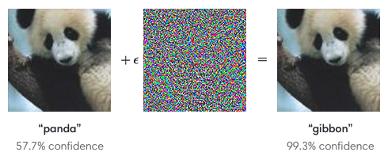

# Fast Gradient Sing Method

The task involves developing a program that manipulates images by adding adversarial noise.
This noise is designed to trick an image classification model into misclassifying the altered image as a specified target class, regardless of the original content.

You may select any pre-trained image classification model for this task.
A model from the torchvision library is recommended, but not mandatory.
The core challenge is to effectively introduce noise into the image in such a way that the model misclassifies it as the desired target class, without making the noise perceptible to a casual human viewer.



Input:

The user will provide an image and specify a target class.

Output:

The program should output an image that has been altered with adversarial noise. The altered image should be classified by the model as the target class, irrespective of the original image's content. The altered image should not be obviously different to the original.

## Setup

We use [pixi](https://github.com/prefix-dev/pixi) to setup a reproducible environment with predefined tasks.
If you would like to use other project management tool, the list of dependencies and tasks are available in [pixi.toml](pixi.toml).

Clone this repo and install the dependencies of the project in a local environment.

```bash
git clone https://github.com/IlyaOrson/FGSM.git
cd FGSM
pixi install  # setup from pixi.toml file

# this was tested on windows with cuda 11 already available
# pixi project platform add linux-64  <-- run this before pixi install to resolve deps on linux
```

Voila!

## Usage

An activated shell within this environment will have all dependencies working.

```bash
pixi shell
python solution.py --help  # see available parameters
```

We include a subsample of ImageNet in imagenet10/ for testing
```bash
# This will modify the image of a chicken to predict a goldfish
python solution.py -i chicken.JPEG -t 1 -m 500 -e 0.001
```

### Datasets used

Downloaded the ImageNet classes from here
https://github.com/pytorch/hub/blob/master/imagenet_classes.txt

Found locally subsamples of ImageNet here
https://github.com/ultralytics/yolov3/issues/2022
